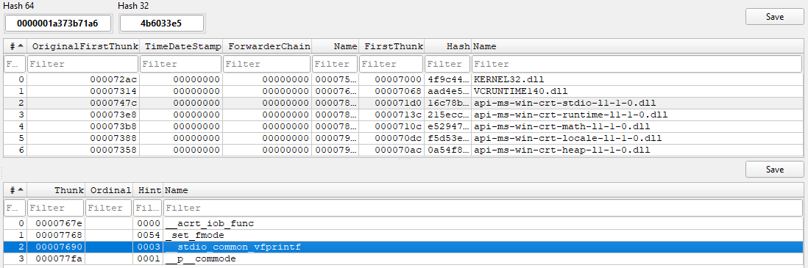

La IAT es una tabla interna del binario PE donde Windows guarda las direcciones de las funciones importadas (por ejemplo, printf, Sleep, etc.).

Cuando cargas un ejecutable, el loader rellena la IAT con direcciones reales de esas funciones.

## .idata (Disco)

```
dumpbin /headers bin\main.exe > headers.txt
dumpbin /imports bin\main.exe > imports.txt
```



- ``Thunk``: Durante la carga del programa, el Windows loader reemplaza este valor con la dirección real en memoria de la función importada.


## .idata (Memoria)

