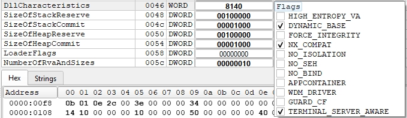

# ASLR (Address Space Layout Randomization)

ASLR cambia aleatoriamente las direcciones de memoria donde se cargan ejecutables y librerías para dificultar exploits.

En Windows, ASLR se controla a nivel de cabecera PE (Portable Executable) usando el flag DYNAMICBASE

Desde Visual Studio 2012 en adelante, el linker de MSVC habilita ASLR de forma predeterminada para binarios nuevos, salvo que explícitamente se desactive con /DYNAMICBASE:NO

En Windows modernos (Windows 10/11), ASLR no siempre genera una reubicación distinta en cada ejecución. Esto pasa porque el sistema optimiza usando "pre-randomización" o rebasing a nivel de sesión:
    - Cuando ejecutas un programa repetidamente sin reiniciar el sistema, Windows suele reutilizar la misma asignación de direcciones para esa aplicación.

En Windows hay algo llamado "high-entropy ASLR" (64 bits), que ofrece mucha más entropía, pero también depende de que el binario tenga /HIGHENTROPYVA y esté compilado para x64.

## _IMAGE_OPTIONAL_HEADER.DllCharacteristics

## Calculo de ASLR y relocaciones

Cuando Windows carga un ejecutable (.exe) o una librería (.dll), el Loader del kernel (ntoskrnl.exe) junto con el User-mode loader (ntdll.dll) deciden dónde colocar el módulo en el espacio de direcciones virtuales del proceso.

ASLR interviene aquí para asignar una dirección base aleatoria distinta dentro del rango permitido.

Cada ejecutable o DLL en Windows tiene un encabezado PE que incluye una tabla de relocations (.reloc).

Memory Manager (MmAllocateVirtualMemory)
    - Consulta el rango permitido de ASLR.
    - Consulta los rangos libres usando las Virtual Address Descriptors (VAD).
    - Elige una base aleatoria alineada a la página
    - Devuelve esa dirección base.

## 32 vs 64

- En 64 bits: rango grande (por ejemplo, 0x0000000140000000 a 0x7fffffffffff)
- En 32 bits: rango más limitado (~2 GB)

## Como interpretar la tabla RELOCS
