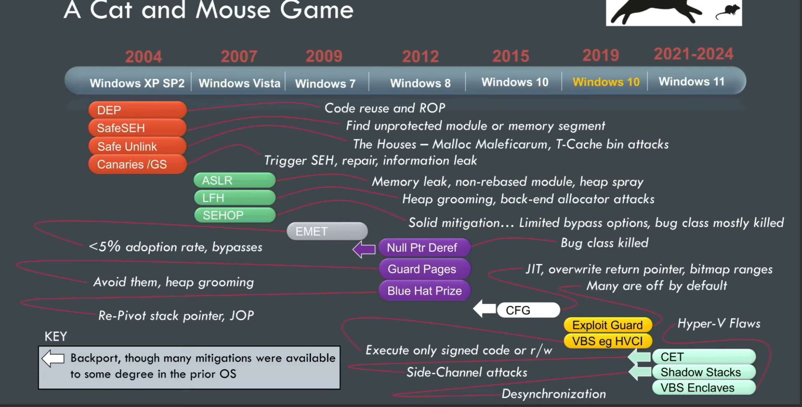

- (DEP) Data Execution Prevention 
- (ASLR) Address Space Layout Randomization
- CFG

---

- Exploit Guard
- (UAC) User Account Control 

> fuente: https://www.youtube.com/watch?v=cHsRxkfxvq8&t=2492s
