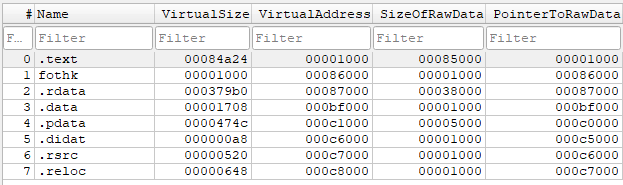

# Portable Executable (PE)

Un "image" = representación completa de un ejecutable (PE) cargado en memoria. Se llama así porque el loader de Windows mapea el archivo en disco en la memoria virtual del proceso como una imagen coherente del binario (cabeceras + secciones + datos).

1. IMAGE_DOS_HEADER
    - (e_lfanew) offset a NT Headers.
2. IMAGE_OPTIONAL_HEADER
    - (AddressOfEntryPoint) RVA del primer byte que se ejecuta
    - (ImageBase) - Dirección favorita para carga el PE
2. IMAGE_SECTION_HEADERS
    - (PointerToRawData) offset en disco de la seccion
    - (VirtualAddress) rva en memoria desde la base a la seccion
    - 

## Imports

IMAGE_DIRECTORY_ENTRY_IMPORT

En disco el IAT es una tabla vacía de punteros que el loader rellenará

## Exports (en memoria)

IMAGE_DIRECTORY_ENTRY_EXPORT

Export Address Table (EAT): lista de RVAs de funciones exportadas
Export Name Table (ENT): lista de RVAs de strings con los nombres de las funciones exportadas
Export Ordinal Table (EOT): mapea nombres a ordinals y entradas del EAT

> Para una guia pasa a paso sobre recorrer la export table [walking_export_table](../walking_export_table/README.md)

---

EntryPoint:
- Memoria: ImageBase + AddressOfEntryPoint
- Disco: (AddressOfEntryPoint - VirtualAddress) + PointerToRawData

