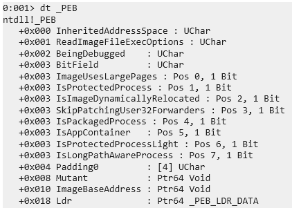

# PEB (Process Environment Block)

Estructura interna de Windows no definida, Windows no proporciona una struct oficial y esta puede cambiar entre builds. 

Solo en modo usuario y está asociado a cada proceso individual.

Informacion importarte que podemos encontrar en el PEB:
- ImageBaseAddress
- BeingDebugged
- Ldr (PEB_LDR_DATA)

La forma más fácil de ver esta estructura es desde windbg.

```bash
# Ver PEB
dt _PEB @$peb
# Ver _PEB_LDR_DATA
dx @$peb->Ldr
dt _PEB_LDR_DATA <direccion>
# Ver _LDR_DATA_TABLE_ENTRY
dt _LDR_DATA_TABLE_ENTRY @esi
dx @$peb->Ldr->InLoadOrderModuleList.Flink
dt _LDR_DATA_TABLE_ENTRY <direccion>
# Ver nombre del modulo
dt _UNICODE_STRING @esi+0x2c
```

## x86 Ver Modulos Cargados en el proceso 

### _PEB

### _PEB_LDR_DATA

### _LIST_ENTRY

### _LDR_DATA_TABLE_ENTRY

## _UNICODE_STRING


## x64 Ver Modulos Cargados en el proceso 
