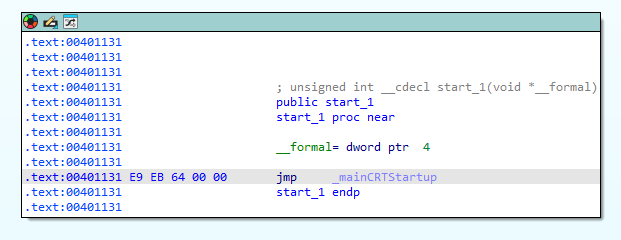

## ASLR

Cuando clono el ejecutable me cambia el AddressOfEntryPoint

## Memoria:
AddressOfEntryPoint - RVA del primer byte que se ejecuta al iniciar el programa
BaseOfCode - RVA donde empieza la sección de código ejecutable (.text).
BaseOfData - RVA donde empieza la sección de datos inicializados
ImageBase - Dirección virtual preferida donde se carga el PE en memoria
VirtualAddress - Inicio de la seccion en memoria

## Disco:
PointerToRawData: Inicio de seccion en disco

> Tener en cuenta que por ejemplo en C el entry point es el crt startup y no main (en IDA start)

EntryPoint:
- Memoria: ImageBase + AddressOfEntryPoint
- Disco: (AddressOfEntryPoint - VirtualAddress) + PointerToRawData

---

## modificar el codigo del entry point para que contenga mi shellcode

Disco, calcular el offset al densde el inicio de la seccion al entry point 

(00001131 - 00001000) + 00000400 = 531

la primera aproximacion me da un error 0xC0000005 el ejecutar con doble click y un ERROR_SEM_NOT_FOUND des x32dbg

Mi primera teoria es que al alargar la seccion .text al copiarla en memoria pisa algo de otra seccion 

ahora voy a probar a anyadir el codigo de la shellcode y borrar casa que ya estaban para no aumentar el tam de .text

ahora ya puedo ejecutar mi codigo, aunque peta a mitad ejecucion

lo que esta pasando es que las etiquetas que utiliza como variables no estan funcionando bien

Claro los permisos de .text son ER no puede escribir en esa direcciones

puedo hacer el mismo codigo sin escrituras en memoria?

he modificado el shellcode para que solo escriba en la pila y ahora funciona.

Mi siguiente idea es, cargar el shellcode en una direccion de memoria donde ahora haya 00 y poner el entry point ahi

En el orignial el Entry point esta en disco 0x531
La shellcode va a estar en 34FO

34f0 - 532 = 2fbf, la distancia en el AddressOfEntryPoint original y el nuevo

1131 + 2fbf = 000040f0 | f0400000 nuevo rva

y funciona sin problemas, ahora lo ideal seria al final del shellcode poner un salto al codigo inicial, puedo hacer: pillo del peb la base donde esta cargado en memoria y de ahi le sumo el rva original y salto ahi

La primera duda que me surge es si saltara el CFG

En algun punto me habre cargado el PE ahora poniendo el entry point original tampoco funciona xd

Claro si ejecuto un programa que no para con doble click no se que esperaba ver :'(

y soprendente, todo funciona bien

ahora vamos a probar a hacer lo mismo con el ejecutable de la calculadora

calc.exe 

Memoria:
ImageBase: 0000000140000000
AddressOfEntryPoint: 00001740
BaseOfCode: 00001000

Disco:
PointerToRawData: 1000
VirtualSize: cb0, Tamaño real que la sección ocupa en memoria una vez cargada
SizeOfRawData: 1000, Tamaño en disco (en el fichero PE) de los datos de la sección

(AddressOfEntryPoint - BaseOfCode) + PointerToRawData

(00001740 - 00001000) + 1000 = 1740 "Entrypointendisco"

Ahora comprobamos si esto es cierto haciendo una ejecucion con x64dbg y mirando el binario a ver si los entry points esperados coinciden

Muy bien, los calculos son conrrectos, el entry point en disco y ejecucion coinciden

Ahora vamos a buscar un blob dentro de .text donde entre el shellcode

vamos a buscar entre 1740 y 2740 que serian los direccion de .text en disco

vamos a poner el shellcode en disco en: 1cb0

---
