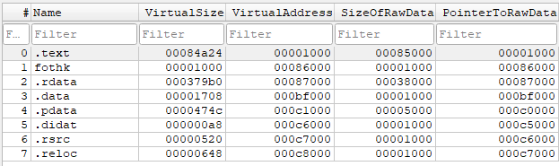

# Portable Executable (PE)

1. IMAGE_DOS_HEADER
    - (e_lfanew) offset a NT Headers.
2. IMAGE_OPTIONAL_HEADER
    - (AddressOfEntryPoint) RVA del primer byte que se ejecuta
    - (ImageBase) - Dirección favorita para carga el PE
2. IMAGE_SECTION_HEADERS
    - (PointerToRawData) offset en disco de la seccion
    - (VirtualAddress) rva en memoria desde la base a la seccion
    - 

## Imports

IMAGE_DIRECTORY_ENTRY_IMPORT

En disco el IAT es una tabla vacía de punteros que el loader rellenará

## Exports (en memoria)

IMAGE_DIRECTORY_ENTRY_EXPORT

Export Address Table (EAT): lista de RVAs de funciones exportadas
Export Name Table (ENT): lista de RVAs de strings con los nombres de las funciones exportadas
Export Ordinal Table (EOT): mapea nombres a ordinals y entradas del EAT

``` scss
BaseDll (dirección base del módulo)
 └── 0x3C [últimos 4 bytes Primera sección] (Offset to NtHeaders)
    └── Saltar a NtHeaders (ImageBase + e_lfanew = dirección de IMAGE_NT_HEADERS)
        └── IMAGE_OPTIONAL_HEADER
        └── DataDirectory[0] (RVA a IMAGE_EXPORT_DIRECTORY)
            └── Offset (0x78 o 0x88) desde el inicio de NT Headers -> Offset to IMAGE_EXPORT_DIRECTORY 
                └── Saltar a IMAGE_EXPORT_DIRECTORY
                    └── [0x0C] -> NumberOfNames
```

---

EntryPoint:
- Memoria: ImageBase + AddressOfEntryPoint
- Disco: (AddressOfEntryPoint - VirtualAddress) + PointerToRawData

