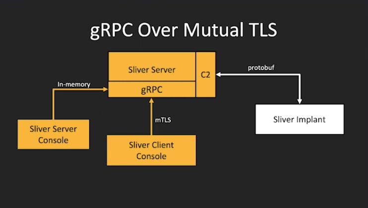
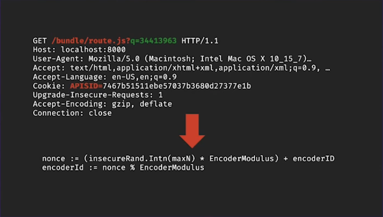
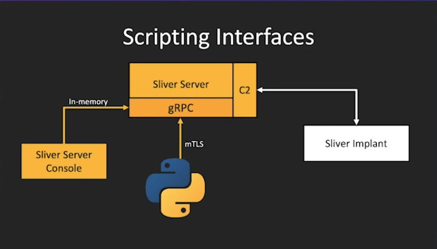
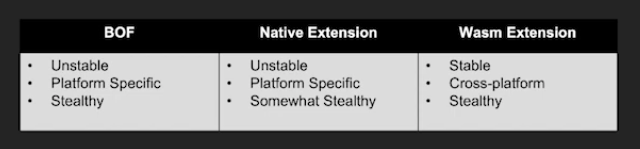

https://github.com/BishopFox/sliver

Sliver is generally designed as a stage 2 payload
Sliver implants in v1.5 and later support two modes of operation: "beacon mode" and "session mode."

# Sliver C2

## Features

- Go (Cross-platform)
- Dynamic code generation
- Per-binary encryption keys
- dinamic add dedug modo on implants
---
- Windoes process migration
- Windows process injection
- user token manipulation
- in-memory .NET execution
- COFF / BOF in-memory execution
- Sideloading
- Chromium runtime injection

## Architecture

gRPC Over Mutual TLS

## Antifingueprinting
(min:37) https://www.youtube.com/watch?v=tkjMZuZ_8nw
importante: los equipos de thread inteligence monitorean potencialemnte todos los ip publicas
si se detecta por ejemplo un server de cobal strike se reporta y muchas empresas bloquearian esa ip
automaticamente, aloemjor en 1h tu servir c2 ya estaria bloqueado aun sin haber establecido 
comunicacion con el implante

- server: only responde to cryptographically attributable trafic
- mTLS / WireGuard
- Generic Go JARM for mTLS
---
- OPAQUE
- Pre-shared RSA
- RSA EKE
---
- TOTP "hello" with NaCI Box
- ChaCha20-Poly1305
- Replay detection
- Randomized JARM/X.509

## Protocolos de red
-  HTTP(s) C2

- DNS c2
- mTLS(TCP)
- WireGuard(UDP)

## Serializacion datos (server-implant)
- protobuf (recomendado): code generation is non ideomatic
- json: self-describing
- msgpack: lack of library support

## Sliver for blue teams

Cliente scripteable

## Traffic encoders

Los operadores pueden definir sus propias funciones para codificar/decodificar trafico

wasm runtime para cargar logica en tiempo de ejecucion
wsam(so independent, arch independent)

## Wasm/Wasi

Cargar tools en memoria en la victima

BOF Beacon objet files:
tradicioianl mente cargando c object files

Native Extensions
cargar una dll en memoria

Wasm extensinos
se ejecutan el la vm de wasm