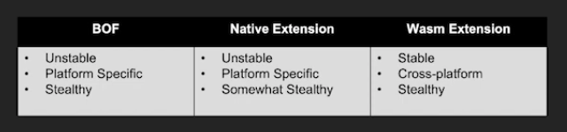

# Sliver C2

Repositorio oficial: https://github.com/BishopFox/sliver

## Características principales

- Go (multiplataforma)
- Generación dinámica de código
- Claves de cifrado únicas por binario
- Modo debug dinámico en implantes
- Utilidades en Windows:
    - Migración de procesos
    - Inyección en procesos
    - Manipulación de tokens de usuario
    - Ejecución .NET en memoria
    - Ejecución COFF/BOF en memoria
    - Sideloading (carga lateral de DLL)
    - Inyección en runtime de Chromium

> **NOTA**: Cargar tools en memoria en la victima
>
> 
> - BOF (Beacon Object Files):
>     - Tradicionalmente carga archivos objeto C
> - Native Extensions:
>     - Carga DLL en memoria
> - Wasm extensinos:
>     - Se ejecutan en la VM de WASM

## Modos de operación

**Beacon**: 
- Típico de Cobalt Strike
- El implante contacta periódicamente (5 min, 1h, 1 semana) para recibir comandos

**Session**: 
- Típico de Meterpreter
- Comunicación en tiempo real
 
> *Flujo recomendado*: Generar por defecto un beacon. Si se necesita interacción en tiempo real, escalar a session.

---

## Arquitectura (gRPC sobre Mutual TLS (mTLS))

- `gRPC` es un framework de comunicación rápido y eficiente basado en HTTP/2
- `mTLS` garantiza que ambas partes son quienes dicen ser y cifra todo el tráfico.
- `gRPC sobre Mutual TLS (mTLS)` es una forma de comunicación segura en la que tanto el cliente como el servidor se autentican mutuamente mediante certificados digitales antes de intercambiar datos. 

> En resumen, combina el rendimiento de gRPC con la robustez de mTLS para ofrecer conexiones cifradas, autenticadas y confiables en entornos distribuidos o de microservicios.

## Protocolos de red soportados

Capa de transporte: HTTP(S), DNS, mTLS, WireGuard → cómo viajan los paquetes

> **Objetivo**: Evitar al máximo patrones detectables con regex o firmas estáticas. Cada mensaje debe tener el menor número posible de elementos repetidos.

-  HTTP(s) C2
- DNS c2
- mTLS(TCP)
- WireGuard(UDP)

---

## Anti-fingerprinting

(min 35:33) – [Vídeo del creador](https://youtu.be/tkjMZuZ_8nw?t=2134)

Medidas Anti-fingerprinting de Sliver:

- Servidor: Solo responde a tráfico criptográficamente atribuible
- mTLS / WireGuard
- JARM genérico de Go para mTLS

> **NOTA**: Los equipos de `Threat Intelligence` monitorean potencialmente todas las IPs públicas. Si detectan, por ejemplo, un servidor de Cobalt Strike, lo reportan y muchas empresas bloquean esa IP automáticamente (a veces en menos de 1 hora) incluso sin haber establecido comunicación con el implante.

#### Algoritmos de autenticación:

- `OPAQUE`: Protocolo de autenticación resistente a ataques offline, sin exponer credenciales.
- `Pre-shared RSA`: Claves RSA precompartidas para autenticación segura sin intercambio inicial.
- `RSA EKE`: Intercambio de claves encriptado con RSA para establecer sesión segura.

#### Build in Anti-fingerprinting (HTTPS & DNS servers):

- `TOTP "hello" con NaCl Box`: Primer mensaje autenticado con contraseña de un solo uso (TOTP) y cifrado asimétrico seguro (NaCl).
- `ChaCha20-Poly1305`: Cifrado autenticado de alto rendimiento para todo el tráfico posterior.
- `Detección de replay`: Prevención de ataques de repetición mediante nonces únicos.
- `JARM y certificados X.509 aleatorizados`: Huellas TLS dinámicas que evitan firmas estáticas y bloqueos automáticos.

#### Serializacion datos (server-implant)

Capa de aplicación: Protobuf, JSON, MsgPack → cómo se empaquetan los datos dentro del mensaje

- Protobuf: (recomendado)Generación de código no idiomática, pero eficiente
- JSON: Auto-descriptivo
- MessagePack: Falta de soporte en algunas librerías

#### Traffic Encoders

Los operadores pueden definir funciones personalizadas para codificar/decodificar tráfico.

- WASM runtime → Cargar lógica en tiempo de ejecución
- WASM/WASI → Independiente de SO y arquitectura

## Flujo completo de un mensaje en Sliver

1. Aplicación(Server)
    - Datos
2. Serialización
    - Formato de datos (Protobuf)
3. Traffic Encoder
    - Codificación personalizada (WASM que aplica XOR rotativo)
4. Cifrado / Autenticación 
    - mTLS, WireGuard, ChaCha20 (Cifrado)
5. Protocolo de red
    - Transporte (HTTP(S), DNS, mTLS(TCP), WireGuard(UDP))

## Ejemplo peticion http

## Sliver for blue teams

Cliente totalmente scripteable

