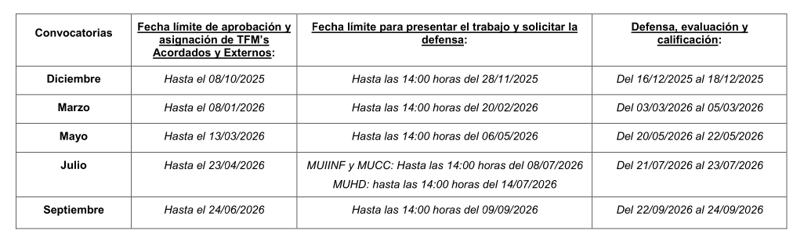

## Idea base

Explorar distintas áreas para definir la orientación de mi carrera
Aprender y construir un portfolio

## Que se ha hecho

- Shellcode:
    - MessageBox (32 y 64 bits)
    - Reverse shell (32 bits)
- BadUSB payload con bypass de AMSI para la ejecución de una reverse shell
- Carga reflexiva de una DLL en memoria
- Carga de un implante de Sliver en memoria mediante DLL hijacking: DLL proxy, DLL sideloading y carga reflexiva
- Extracción de artefactos con KAPE

## Organizacion de la memoria

- Textos preliminares
- Explicación del ataque:
    - Resumen ejecutivo
    - Kill chain
    - Mapeo con las técnicas MITRE
    - Mapeo con los artefactos relevantes
- Explicación de las técnicas utilizadas
- Anexo: explicaciones adicionales que no se han incluido en el apartado anterior

---

- Binary patching: modificar un ejecutable compilado para que lance primero el shellcode de MessageBox y posteriormente se ejecute con normalidad (no utilizado en el proyecto)
- Direct e indirect syscalls (no utilizado en el proyecto)

---

