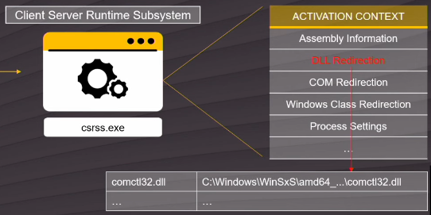

# WinSxS

[Activation Context Hijack | Kurosh Dabbagh](https://www.youtube.com/watch?v=qu4fXWKjabY)

## DLL Hell

anterioremente la unica copia de los recursos compartidos (dlls) estava en system 32

si instalar una app que hace uno de la dll instalada en el sistema y concide con la version hay instalada todo perfecto

pero si necesitas otra version durante la instalcion se machaca la unica copia que hay en system 32 con la version especifica que necesita la app

ahora la nueva funciona para le viaje se ha roto

tener solo una copia de un recurso compartido por muchas app generaba muchos conflictos

solucion:

windos xp -> windows side-by-side

assembly
- conjunto de recusos (ficheros que exportar funcionalidades) indentificados por un manifest (xml)

    recursos (conjunto de ficheros acompanyados de un menifest):
    - dlls
    - objetos COM
    - Iconos
    - Recusos de idioma
    - Mnifisto (siempre presente, le otorga identificador unico al recurso)

C:\Windows\WinSxS (almacen de recursos compartidos)
- Repositorio global

El nombre de colorines sera el nombre de la carpeta en `C:\Windows\WinSxS`

si una aplicacion quiere utilizar windows side by side debe embeber un manifest en el propio exe

- este es un manifest de aplicacion de dice al SO que ensamblados necesita utilizar

el so creara el proceso en estado suspendido y le pasara la ejecucion a `csrss.exe` (Client Server Runtime Subsystem) para que resuelva las dependencias del manifest

`csrss.exe` recibe el manifest y lo procesa

todo el resultado de parseo por csrss.exe se va a ver reglejado en memoria del proceso activation context (solo lectura) despues se deuvleve la ejecucion al proceso y sigue con su lanzamiento normal

