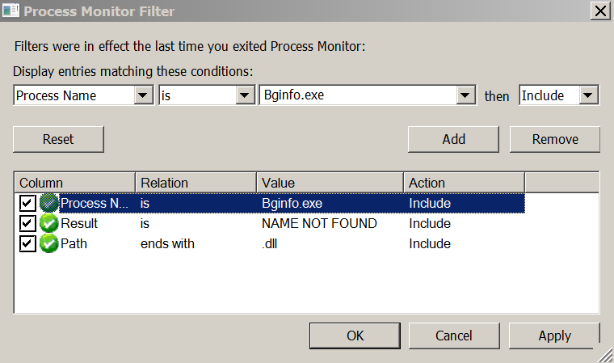

# DLL Hijacking

https://pentestlab.blog/2017/03/27/dll-hijacking/

las dll se cargan en el orden de: `echo %PATH%`

1. The directory from which the application is loaded
1. C:\Windows\System32
1. C:\Windows\System
1. C:\Windows
1. The current working directory
1. Directories in the system PATH environment variable
1. Directories in the user PATH environment variable

sal dll de esta clave de registro estaran cargadas en system32 no hay mucho que hacer

`Computer\HKEY_LOCAL_MACHINE\SYSTEM\CurrentControlSet\Control\Session Manager\KnownDLLs`
## Step 1 – Processes with Missing DLL’s

The first step is to list all the processes on the system and discover these processes which are running as SYSTEM and are missing DLL’s. This can be done just by using the process monitor tool from Sysinternals and by applying the filters below:

NAME NOT FOUND

## Step 2 – Folder Permissions

By default if a software is installed on the C:\ directory instead of the C:\Program Files then authenticated users will have write access on that directory. Additionally software like Perl, Python, Ruby etc. usually are added to Path variable. This give the opportunity of privilege escalation since the user can write a malicious DLL in that directory which is going to be loaded the next time that the process will restart with the permission of that process.

## Step 3 – DLL Hijacking

1. Creamos una dll que abra un messagebox cuando se cargue
2. la copiamos en: `C:\Windows\cscapi.dll`
3. paramos explorer: `taskkill /im explorer.exe /f`
4. volvemoa a ejecutar explorar: `c:\Windows\explorer.exe`

## Proxy loading

podemos hacer que nuestra dll maliciosa haga de proxy y llama a la real para no romper la funcionalidad