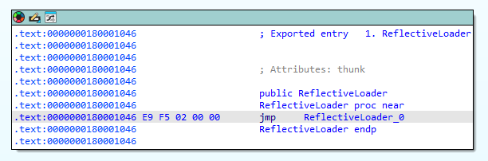
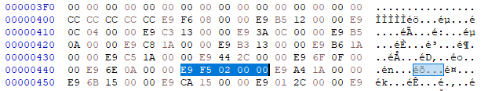
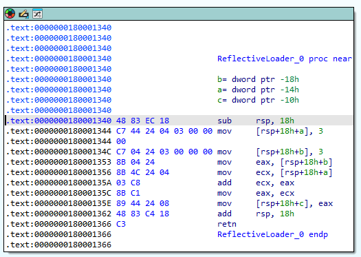
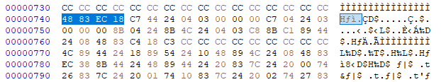
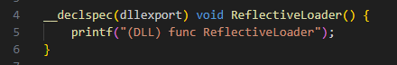
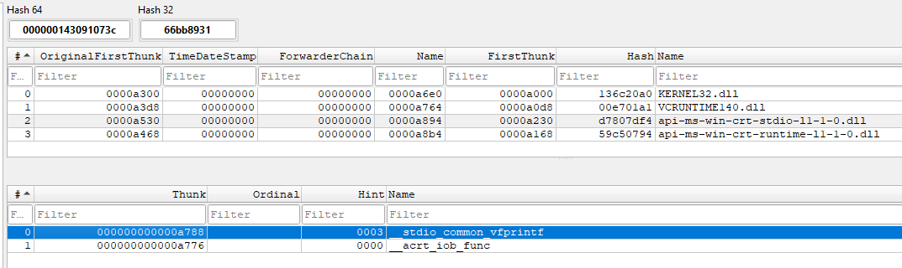

https://github.com/stephenfewer/ReflectiveDLLInjection

# Paso-1 INJECT (cargar la dll en el proceso objetivo)
    - Abrir un handle al proceso objetivo
    - Reserve un chunk de memoria
    - Copie el PE de la dll
    - Ejecutar ReflectiveLoader() en la dll 
        - CreateRemoteThread()
        - asm stub

## Calcular ``ReflectiveLoader()`` (memoria vs disco)

Con DIE sacamos:
- RVA de la funcion en memoria: 0x1046
- .text disco: 0x400
- .text memoria 0x1000

Sabemos que la funcion esta 0x46 bytes dentro de la seccion .text

porque existe ReflectiveLoader y ReflectiveLoader_0?

El linker genera este stub automáticamente cuando la función es exportada, y la primera entrada corresponde al nombre público de exportación en la Export Address Table (EAT).

E9 F5 02 00 00

E9 = JMP rel 32, salto relativo de 32 bits
F5 02 00 00 = 0x000002f5 = 757

Destino = EIP + (1 byte jmp) + (4 bytes numero) + 0x2f5

0x446 + 0x1 + 0x4 + 0x2f5 = 0x740

---

Cuando un DLL exporta una función, el export table necesita apuntar a una dirección conocida para que otros módulos puedan llamarla.

No apunta directamente a la función real en la sección .text.

En su lugar, el linker crea un stub o trampolín al inicio de la función exportada.

Este stub se coloca en la sección .text en la dirección que figura en la Export Address Table (EAT).

Así, cualquier llamada a ReflectiveLoader desde otro módulo o proceso salta primero al stub, y desde ahí al código real.

---

## Porque ``printf()`` falla la dll?

Como la dll no ha sido importada por el loader la IAT no esta cargada y el codigo no sabe donde esta prinf

## IAT en disco para mockdll.dll

---

# Paso-2 RESOLVE ()

- Tener metodo ReflectiveLoader() que revuelva:
    - Su base addres
    - Obtenga informacion de sus headers (no se cual :/)
    - que obtenga las funciones

---

# Paso-3 LOAD ()

- Desde una dll copiar el PE de una dll y arreglar las relocaciones y arrancar la dll 

